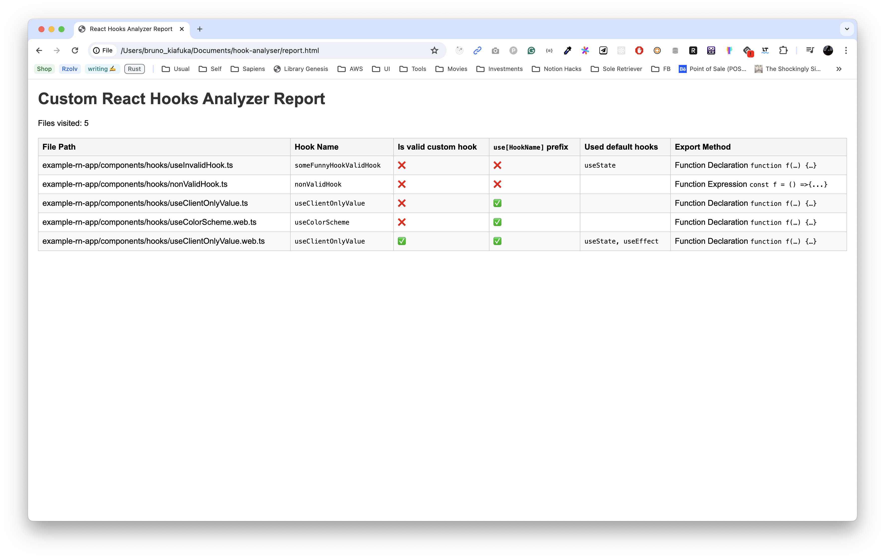

### Hooks Analyzer 🪝🔎

This is a simple tool to analyze the hooks used in a React project. It will list all the hooks used in the project and the number of times they are used.

> [!warning]
> This is a rust practice project and it is not intended to be used in production. 

## How to use 🚀
1. Clone the repository
2. Run `cargo run -- <path-to-react-project>` in the root directory of the project

After successfully running the command, you get a report generated under `report.html` in the root directory of the project. 

### Nice Resources 📚
- [AST Explorer](https://astexplorer.net/#/gist/cd393ae11db32c6c3fa5ba81f7e9d144/c40d3c915fc49f273215586168ac513c04b7853d)

